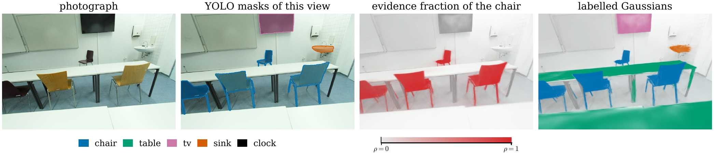
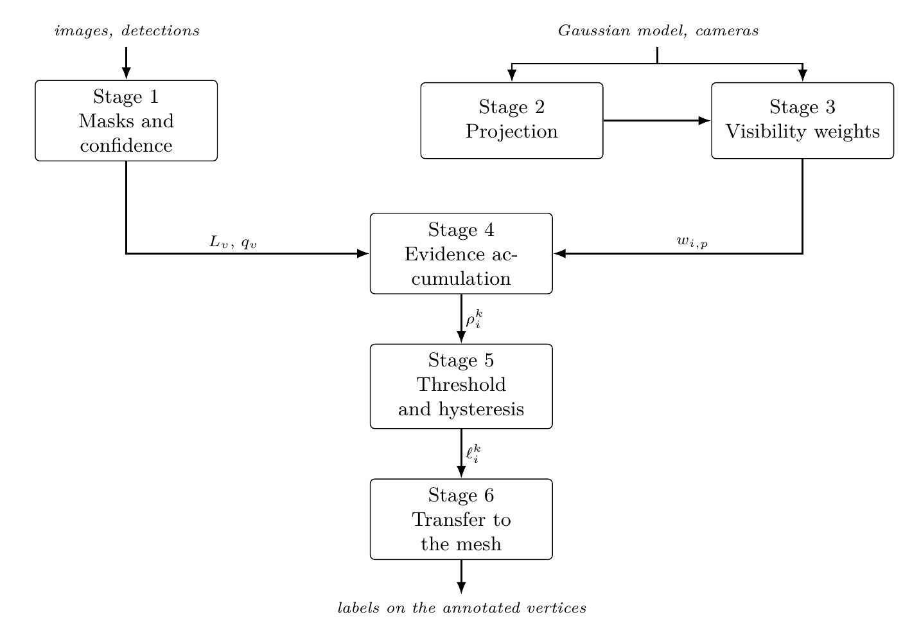
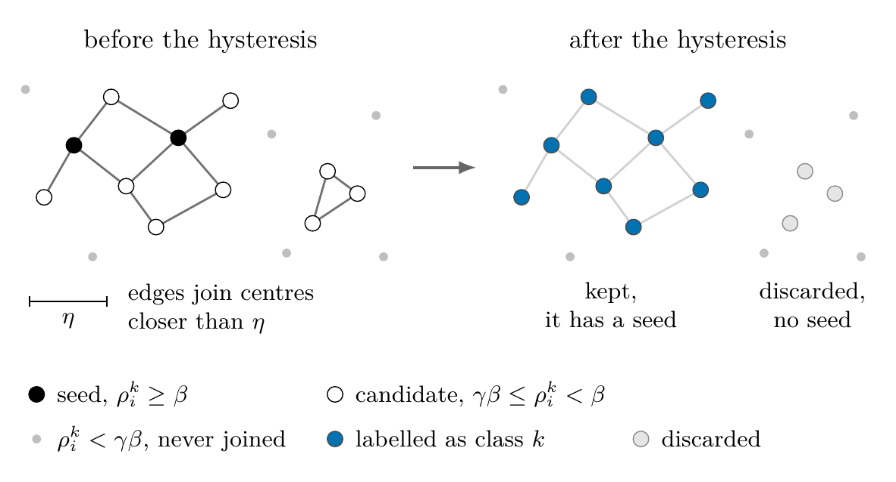
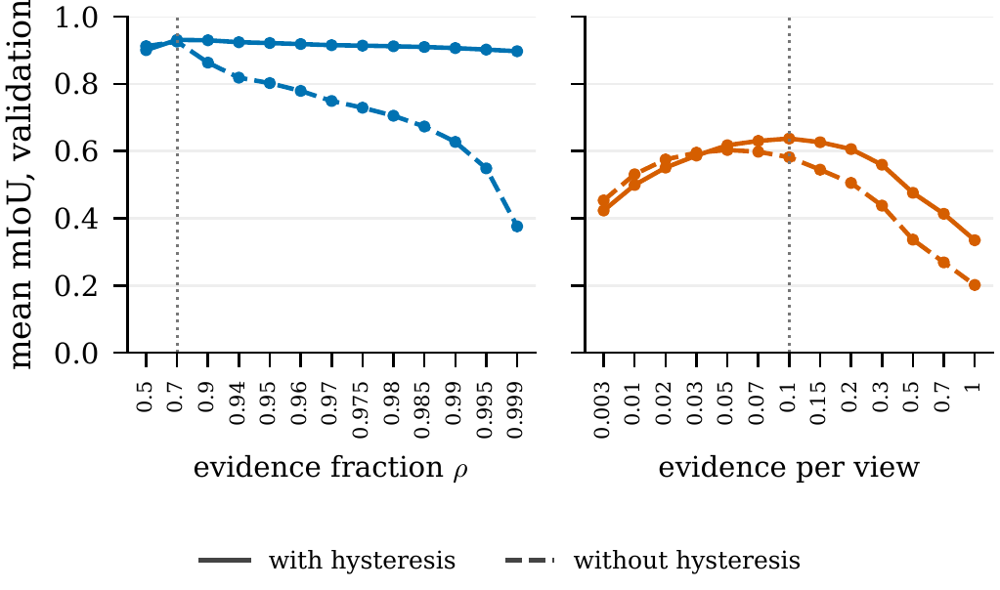
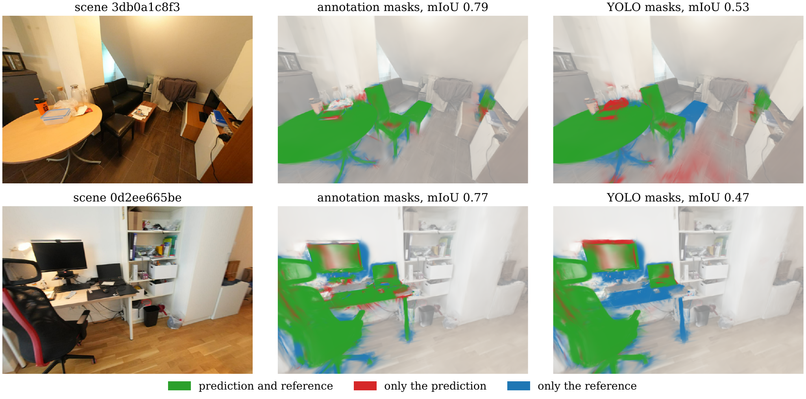

# Post-Training Semantic Lifting for 3D Gaussian Splatting

This repository labels with semantic classes the Gaussians of a 3D Gaussian Splatting model that is already trained, and it also contains the protocol that evaluates the result. The method takes the model, its calibrated cameras and one 2D mask per view. Then, it accumulates on every Gaussian the evidence of belonging to the class and the evidence of not belonging to it, and keeps the Gaussians where the first one is a large enough fraction of the total.

On ten held-out ScanNet++ scenes, the method reaches a mean mIoU of 0.80, with a 95% interval from 0.77 to 0.83, when the 2D masks come from the annotation of the dataset, and 0.54 with the masks of a YOLO detector. The operating point was chosen on seven synthetic Replica scenes and applied to these real scans without retuning anything. Compared with thresholding the evidence per view, as an earlier version of the method did, the fraction improves the test mIoU by 0.24 and is better in all ten scenes.

The Gaussian representation, the training code and the CUDA rasteriser come from the [official Inria implementation](https://github.com/graphdeco-inria/gaussian-splatting). The lifting, the evidence formulation, the hysteresis, the transfer to the mesh and the whole evaluation are my own work, and they live in `segmentation/`, `evaluation/`, `containers/` and `picasso/`. This project is my Bachelor's Thesis at the Universidad de Málaga, supervised by Ezequiel López Rubio and Jorge García González, and it comes with a preprint that gives the full details.

<p align="center">
  
</p>
<p align="center"><em>One view of the ScanNet++ test scene 21d970d8de. The fraction of the chair and the labels come from the YOLO masks of all the views, so the tables are labelled although YOLO does not find them in this one.</em></p>

## How the lifting works

<p align="center">
  
</p>

The method works with one class at a time. Every view gives a label map and a confidence per pixel, either from the detector or from the annotation of the dataset. Both sources are written in the same format, so the rest of the pipeline does not know where the masks come from. The detector is `yolo26x-seg`, and each pixel keeps the confidence of its own detection.

Each Gaussian is projected into every camera and composited in depth order, as the renderer does. In this way, a Gaussian gets a visibility weight on each pixel it reaches, and a Gaussian hidden behind others gets almost nothing from that view. With this weight, two quantities are accumulated in the same pass: the target evidence E⁺, from the pixels of the class, and the non-target evidence E⁻, from the rest. Both see the same occlusions, so the only thing that separates them is the mask.

The decision uses the fraction ρ = E⁺ / (E⁺ + E⁻). A Gaussian becomes a seed when ρ ≥ β, and a Gaussian with ρ ≥ γβ also takes the class when it is connected to a seed through Gaussians closer than η. This is the hysteresis of the Canny edge detector, but on the graph of Gaussian centres instead of on the image. A high β keeps only the clearest Gaussians as seeds, and the hysteresis recovers the rest of the object without the noise around it.

<p align="center">
  
</p>

The visibility weights come from a tile rasteriser written in PyTorch, which follows the CUDA one of 3DGS. It differs from it in the culling and in the compositing loop, and the preprint explains both changes.

## Why a fraction

The first versions of the method thresholded the target evidence itself, first against β times the number of cameras and then against β times the number of views that contain the class. With both of them, choosing β was very difficult, because the best value changed from one class to another. The evidence grows with the size of the object in the image, with its distance and with the occlusions, so a sofa and a clock need different thresholds. In addition, a background Gaussian that many views see collects target evidence at the borders of the masks. The fraction compares the target evidence with all the evidence that reached the Gaussian, so these factors cancel.

To check it, the version with the evidence per view runs as a baseline with exactly the same protocol: the same votes, the same hysteresis, the same transfer and the same selection rule, over its own grid of thresholds.

<p align="center">
  
</p>
<p align="center"><em>Mean validation mIoU along the threshold grid of each score, with the annotation masks. The dotted line is the selected threshold.</em></p>

With hysteresis, the fraction gives almost the same result along its whole grid, while the evidence per view has a narrow peak and goes from 0.34 to 0.64. On the test scenes, the fraction is better by 0.24 mIoU with the annotation masks, with a bootstrap interval from 0.20 to 0.28, and by 0.12 with YOLO masks, from 0.06 to 0.17.

## Evaluation

The ground truth is an annotated mesh, since two trainings of the same scene do not give the same Gaussians. For this reason, the labelled Gaussians are transferred to the mesh, and each vertex takes the label of the closest Gaussian centre within τ = 0.10 m. Only the vertices that are annotated and seen by some camera are scored.

The annotation of the mesh also goes through the Gaussians and back to the mesh with the same operator. That is, this reference already contains what the representation loses, and comparing the method with it separates three sources of error:

| Term | Definition | What it measures |
| --- | --- | --- |
| g<sub>det</sub> | mIoU with annotation masks minus mIoU with YOLO masks | the 2D detector |
| g<sub>lift</sub> | reference minus mIoU with annotation masks | the lifting and the threshold |
| g<sub>rep</sub> | 1 minus the reference | the Gaussian model and the transfer |

Their sum is the total error with YOLO masks.

The parameters were fixed in three steps, and no test scene was used before the last one. Two development scenes, `office_0` of Replica and `7831862f02` of ScanNet++, fixed the transfer radius and the rest of the frozen configuration. Then, the transfer operator and the pair (β, γ) were chosen together on seven Replica validation scenes, among 130 candidates, with a rule written in the code: among the candidates within 0.01 of the best mean, it takes the one with the smallest deviation between scenes. Finally, the ten ScanNet++ test scenes were evaluated with everything fixed. They are the downloaded scenes with the most annotated classes, a rule that only reads the annotation.

A split has only seven or ten scenes, so every mean comes with a 95% bootstrap interval over scenes, and the comparisons between configurations are paired scene by scene.

## Results

| Dataset | Split | Masks | mIoU | 95% interval | Reference |
| --- | --- | --- | --- | --- | --- |
| Replica | validation, 7 scenes | annotation | 0.93 | 0.92 to 0.94 | 0.97 |
| Replica | validation, 7 scenes | YOLO | 0.65 | 0.55 to 0.74 | 0.97 |
| ScanNet++ | test, 10 scenes | annotation | 0.80 | 0.77 to 0.83 | 0.91 |
| ScanNet++ | test, 10 scenes | YOLO | 0.54 | 0.48 to 0.60 | 0.91 |

On ScanNet++, the detector is the largest source of error, with g<sub>det</sub> = 0.26, while the lifting loses 0.11 and the representation 0.09. In other words, with good masks the method is already close to what the Gaussian model allows, and most of what is left to gain is in 2D.

Note that the fusion of views also corrects part of the detector. On ScanNet++, the 3D IoU is higher than the pixel IoU of the YOLO masks in 27 of the 39 pairs of class and scene, and the mean goes from 0.45 to 0.55. When YOLO misses an object in some views, its Gaussians still collect evidence from the views where it finds it. However, the fusion cannot create what no view gives: YOLO was trained on COCO, whose only table is the dining table, and it almost never proposes the desks of ScanNet++.

<p align="center">
  
</p>
<p align="center"><em>Prediction against reference in two test scenes close to the median. The round table of the first scene looks like a COCO dining table and is labelled well with YOLO masks, but the coffee table and the desk of the second scene are missed.</em></p>

The results per class and per scene, the comparison of the two transfer operators, the ablations and the cost are in the preprint.

## Running it

The heavy stages run inside three images: one for COLMAP, one that trains the Gaussian model with the official rasteriser, and one for the masks and the lifting. `containers/` has them as Dockerfiles and as Apptainer definitions. `evaluation/runtime.py` launches each stage with Docker by default, or with Apptainer when `TFG_RUNTIME=apptainer`, with the repository mounted as read only and the data as read and write. The transfer to the mesh and the metrics only need NumPy and SciPy, so they run outside the images.

One scene at the selected point, with both mask sources:

```bash
python -m evaluation.run \
  --dataset scannetpp --scene 3f15a9266d --split test \
  --data-root /path/to/scannetpp --mask-source both \
  --betas 0.7 --hysteresis-gamma 0.8 \
  --gaussian-to-mesh-transfer nearest_neighbor_label --tau 0.10 \
  --save_results_to_csv
```

The whole campaign ran on the Picasso supercomputer of the Universidad de Málaga, on NVIDIA A100 GPUs. `picasso/submit.sh` submits each step with SLURM, with one job per scene where the scenes are independent, from the development sweep to the test and the baseline. A job that reaches its time limit stops between stages, or saves a training checkpoint, and submits itself again. [`picasso/README.md`](picasso/README.md) lists the steps in order.

Each stage stores a JSON with the parameters that invalidate its output. If one of them changes, the run stops and shows the difference, instead of mixing two experiments. The votes do not depend on β, γ or the transfer, so a whole grid of candidates reuses one accumulation per scene, class and mask source. A test scene takes about 41 minutes from scratch on one A100, and once its votes are cached, the thirteen values of β take about 4.5 minutes.

The macros, tables and figures of the manuscripts only read the analytics, so they can be regenerated on any machine:

```bash
python -m evaluation.scripts.make_macros --analytics analytics --analysis analysis --output report/macros_measured.tex
python -m evaluation.scripts.make_tables --analytics analytics --analysis analysis --out report/tables
python -m evaluation.scripts.make_figures --analytics analytics --analysis analysis --out report/figures
```

## Parameters

The values below are the same for every class and every scene. The full list is in `evaluation/run.py`.

| Parameter | Value | Meaning |
| --- | --- | --- |
| `--betas` | 0.7, chosen among 13 values from 0.50 to 0.999 | evidence fraction that a seed must reach |
| `--hysteresis-gamma` | 0.8 | lower threshold as a factor of β; 0 disables the hysteresis |
| `--hysteresis-radius` | 0.05 m | the radius η that connects two Gaussians |
| `--gaussian-to-mesh-transfer` | `nearest_neighbor_label` | operator from Gaussians to mesh, chosen on validation |
| `--tau` | 0.10 m | radius where a vertex looks for Gaussians |
| `--min-fraction` | 0.3 | share of the vote a vertex needs, only in the radius vote |
| `--background-confidence` | 0.25 | confidence of the pixels without any detection |
| `--background-view-policy` | `target_views` | views without the class do not vote |

The detector keeps the detections with a score of at least 0.75, and Replica uses one frame of every five.

## Layout

| Path | Contents |
| --- | --- |
| `segmentation/` | masks, projection and tile rasteriser, evidence accumulation, threshold with hysteresis, renders of the figures |
| `evaluation/` | dataset readers, transfer operators, metrics, cache contracts, container runtime, analytics, campaign drivers, reports |
| `containers/` | the three images, as Dockerfiles and as Apptainer definitions |
| `picasso/` | SLURM jobs and the submission of each step on the Picasso supercomputer |
| `arguments/`, `gaussian_renderer/`, `scene/`, `utils/`, `submodules/`, `SIBR_viewers/` | upstream 3D Gaussian Splatting, with additions to `scene/gaussian_model.py` so a model carries labels |

## Limitations

- A class that does not appear in any mask receives no evidence, so the method cannot recover it.
- Every class runs on its own, so the same Gaussian can take two classes, and nothing makes the labels exclusive.
- The reference depends on the transfer operator, so it measures the cost of the representation for that operator and not for the best transfer possible.
- The rasteriser is written in PyTorch, which makes the vote accumulation the slowest stage.
- No other published method was run on these scenes, so the numbers compare the method with its own baseline and reference, not with the literature.

## Citation

```bibtex
@misc{verdugo2026semantic,
  title  = {Post-Training Semantic Lifting for {3D} {G}aussian {S}platting:
            Separating Detector, Lifting and Representation Error},
  author = {Verdugo Guerra, Iv{\'a}n and L{\'o}pez Rubio, Ezequiel and
            Garc{\'i}a Gonz{\'a}lez, Jorge},
  note   = {Preprint},
  year   = {2026}
}
```

Replica and ScanNet++ are distributed by their own authors under their own terms, and access is requested from them.

## License

The upstream Gaussian Splatting code keeps the Inria and MPII research licence of `LICENSE.md`, which allows non-commercial research use only. The code of `segmentation/`, `evaluation/`, `containers/` and `picasso/` is released under the same terms.
